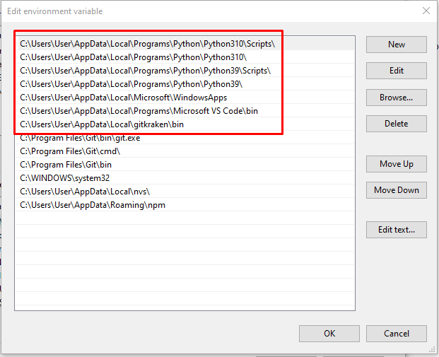
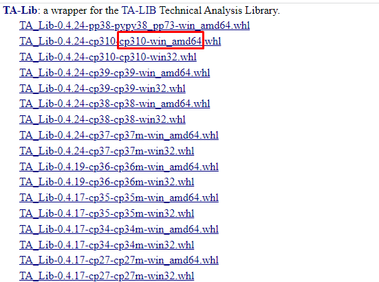

# Index Page

## How to install in cmd line
I am using vscode so just create a new terminal and then do the following

To avoid all types of issues i would suggestion uninstalling anaconda and all of your python installations, unless you know for sure that you need those previous versions for other projects and everything ... or if you are familar with python already and you know what you are doing you can keep them ... but there have been many pathing issues with having different versions and anaconda installed.

So if you do not need to do any of this then you can move to the next section ... but if you do need to unisntall then go an uninstall all of them ... then go to the python website and download python 3.10.10 and then make sure you select add to path when installing and also install for all users.

Also if you have any spaces in the names of your folders make sure you put quotes around the whole thing like "E:/Coding/virtual environments/qfFree/Scripts/activate.bat" ... as you can see i have a space in virtual environments ... so i was getting errors if i ever needed to copy and past a specific directory

make sure your env var looks like mine in the order


Create a new virtual environement by typing this into your command line

```
python -m venv qfPro
```

Now we need to activate the newly created venv
```
qfPro\Scripts\activate
```

last if you still have your ven active then copy past the following pip install
```
pip install -U git+https://github.com/QuantFreedom1022/quantfreedom
```

If you want to work on the dev branch then use this instead. But be warned ... it is called dev for a reason lol.
```
pip install -U git+https://github.com/QuantFreedom1022/quantfreedom@dev
```

If you want to also install the packages that let you build documentation to your changes then add [web] at the end.
```
pip install -U git+https://github.com/QuantFreedom1022/quantfreedom[web]
```

You now should have created a veritual environment

Installation Problems

!!! warning "Installation Problems"
    If you have any trouble or run into installation errors then what i have found is if i shutdown vscode then open it back up and then reactivate my virtual environment then pip install again it is able to make the full install

## Install TA-Lib
To install ta lib you need to do the following

- Go to this website https://www.lfd.uci.edu/~gohlke/pythonlibs/#ta-lib 
- Download the one that has your python version. You can check your python version ( i run python 3.10.10 on a 64bit windows machine so i am going to choose cp310 ) ... if you don't know your python version in the terminal type python --version.

- Once you downloaded the file you need to change your folder path in the terminal by doing cd (download location of folder)
- Once there type in pip install ( full file name of the talib wheel you downloaded)
